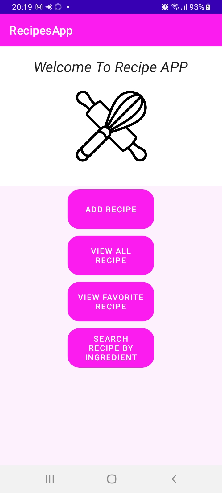
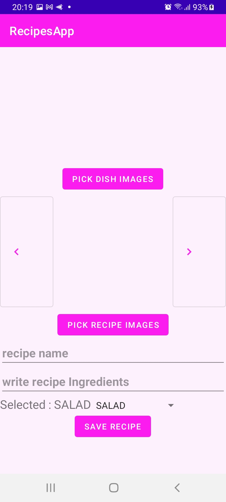
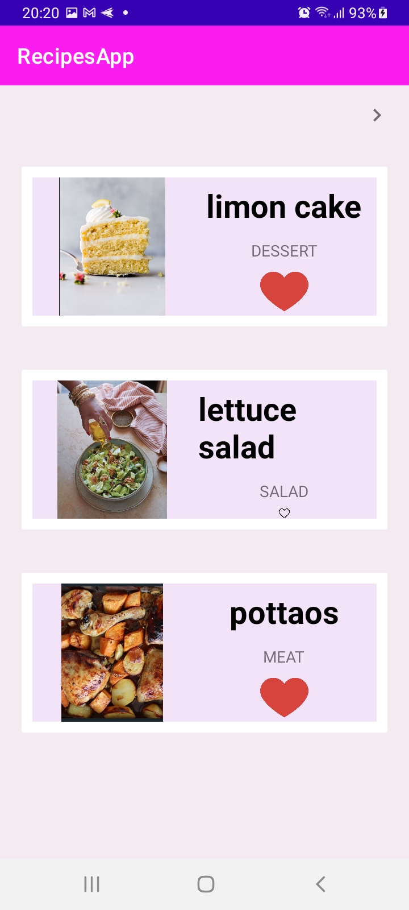
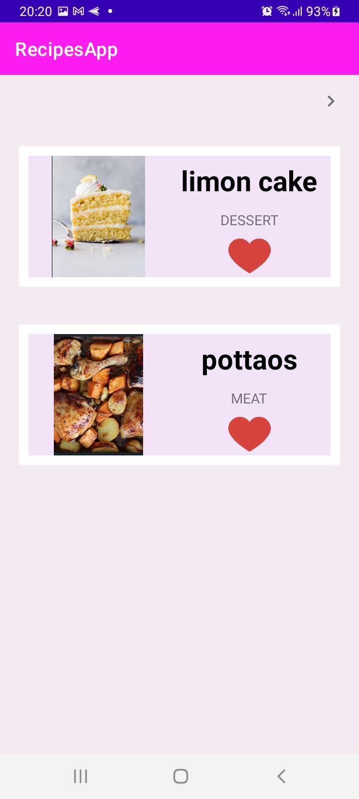
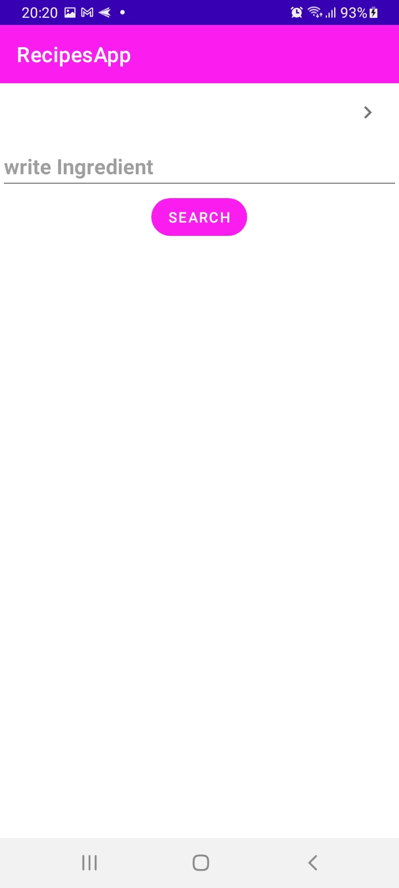

# RecipesApp

In This application, the user can add pictures of recipes then, give a name to that recipe, write the Ingredients of the recipe and choice category.

The user can see all his recipes.

The user can make a favorite list of recipes by clicking on the heard near the recipe and one more click on the heard remove the recipe from the favorite list. 

The user can search recipes by Ingredients.

